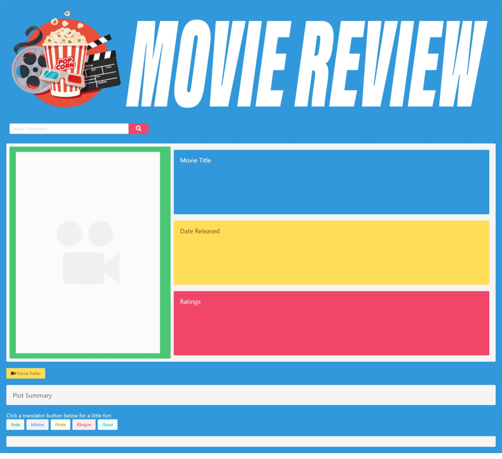
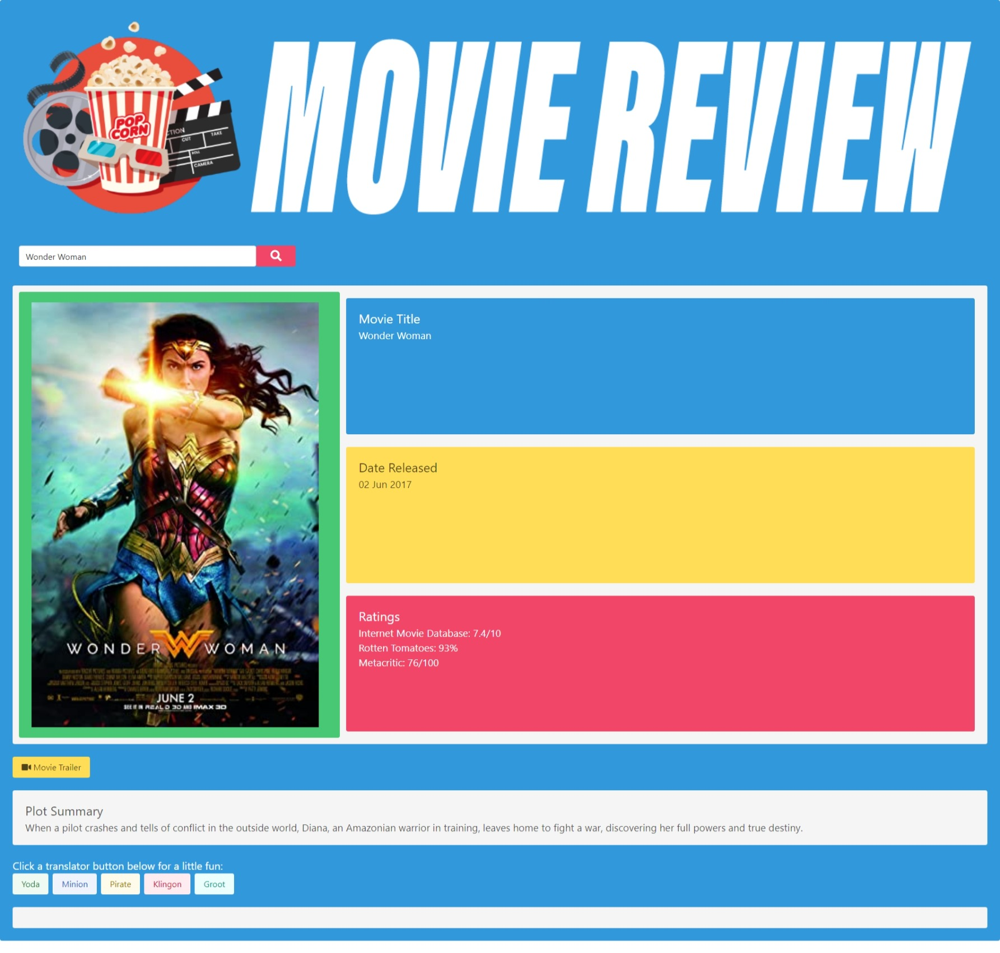

# Assignment 07:  Project One  Movie Review

## Description
This is an interactive application that allows a user to search movie tiles and gain a wealth of information.  Movie enthusiast are presented with one convenient platform for movie titles, descriptions, ratings, plots, trailers, and plot translations.  The plot translations are of the movie plot summary in Yoda, Minion, Pirate, Klingon, and Groot.

The web technologies used in this application include:  HTML, CSS, JavaScript, and jQuery.  The Bulma framework was used extensively to design the layout of the webpage; In addition, this framework manipulates the HTML structure of the webpage with customized CSS expressions.  

## Screenshots of webpage

## Webpage URL

[Movie Review Live Webpage]( https://davidboerm.github.io/project-1/)

## Contributors
- David Boerm
- Bruce Mowrey
- Travis Springer
- D.J. Worthy

## License
None

### Date
27 March 2021
